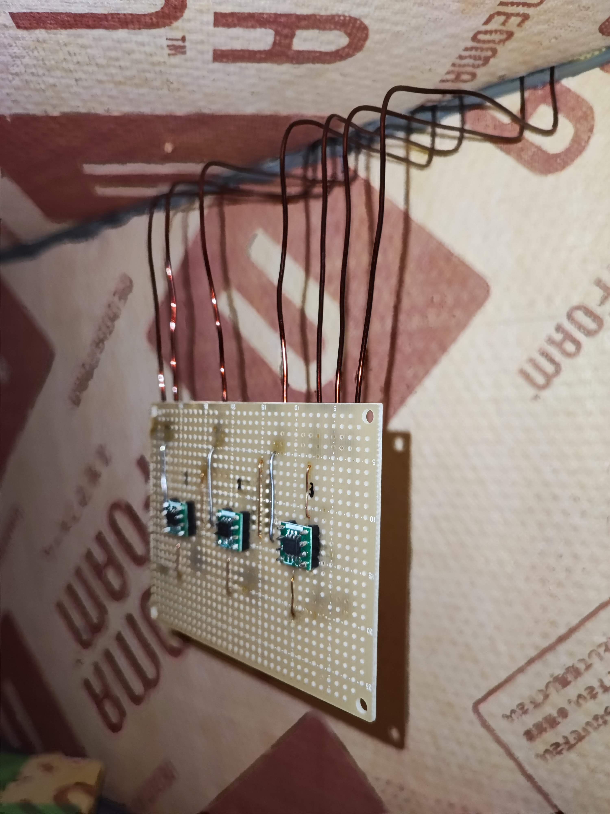

# 自動温調桁焼き器
サーミスタとSSR（ソリッドステートリレー）を用いた自動温調桁焼き器．

## 構成
### センサーモジュール
当初，温度をデジタルデータとして取得したいという思いから，温度センサにLM74を採用する方向で試作を進めた．

しかし，ノイズ耐性の低さや100℃付近での誤差の大きさから，サーミスタへ方針変更した．

### 制御部
マイコンとSSR（ソリッドステートリレー）を搭載している．

## ソフトウェア
マイコンにはRaspberry Pi Pico Wを用いた．
マイコンをアクセスポイント（WiFiの接続先）とし，外部ルーターを必要としないものにした．
WiFiに接続した際の「承認が必要です」などと表示される画面（キャプティブポータル）上で温度管理，制御の変更ができる．

